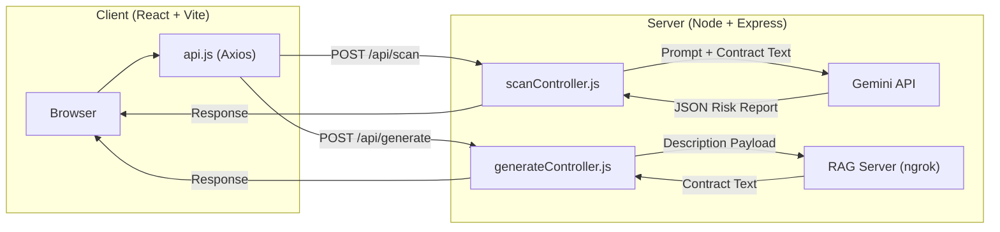
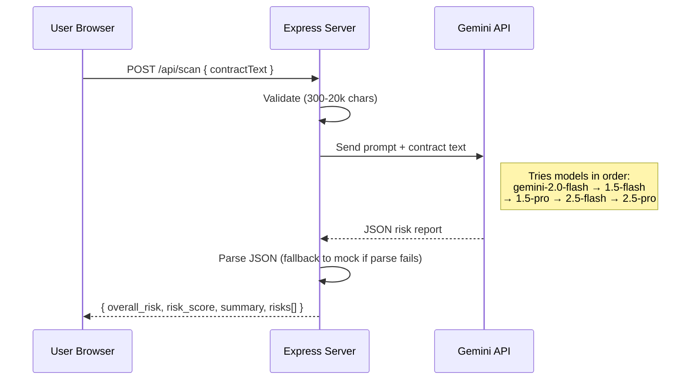
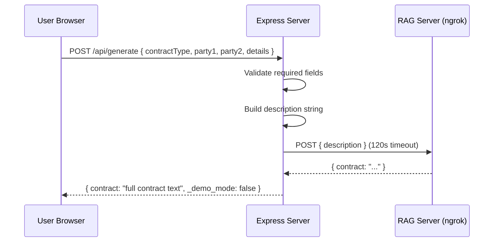

# Legal-GPT — Complete App Context

## 1. What Is This App?

**Legal-GPT** is an AI-powered contract auditing tool built as a hackathon MVP. It helps freelancers and professionals understand legal risks in contracts — instantly, in plain English.

### Two Core Features


| Feature | Route | What It Does |
|---|---|---|
| **Contract Scanner** | `/scan` | User pastes contract text → AI returns a risk report (Red/Yellow/Green) with scored risk cards |
| **Contract Generator** | `/generate` | User fills a form (type, parties, terms) → RAG server generates a complete legal contract |

No login, no database, no PDF upload. Stateless and privacy-first.

---

## 2. Architecture



- **Frontend**: React 19 (Vite), Tailwind CSS, GSAP animations
- **Backend**: Node.js + Express 5, running on port `8080`
- **AI for Scan**: Google Gemini API (tries multiple models in sequence)
- **AI for Generate**: External RAG server via HTTP (ngrok URL)
- **Database**: None — fully stateless

---

## 3. Full File Map

### Server (`/server`)

| File | Purpose |
|---|---|
| [server.js](file:///c:/Users/Hp/Desktop/enigma/server/server.js) | Express app entry, middleware, routes, port binding, error handling |
| [routes/scan.js](file:///c:/Users/Hp/Desktop/enigma/server/routes/scan.js) | `POST /` → calls `scanController.scanContract` |
| [routes/generate.js](file:///c:/Users/Hp/Desktop/enigma/server/routes/generate.js) | `POST /` → calls `generateController.generateContract` |
| [controllers/scanController.js](file:///c:/Users/Hp/Desktop/enigma/server/controllers/scanController.js) | Validates input (300–20k chars), calls Gemini with prompt, parses JSON, falls back to mock data |
| [controllers/generateController.js](file:///c:/Users/Hp/Desktop/enigma/server/controllers/generateController.js) | Validates form fields, calls external RAG server via HTTP, falls back to mock contract |
| [utils/promptTemplate.js](file:///c:/Users/Hp/Desktop/enigma/server/utils/promptTemplate.js) | Structured prompt template for Gemini — enforces strict JSON-only output |
| [.env](file:///c:/Users/Hp/Desktop/enigma/server/.env) | `GEMINI_API_KEY`, `RAG_SERVER_URL`, `RAG_SERVER_ENDPOINT`, `PORT` |

### Client (`/client/src`)

| File | Purpose |
|---|---|
| [App.jsx](file:///c:/Users/Hp/Desktop/enigma/client/src/App.jsx) | Router — defines all 4 routes under `PublicLayout` |
| [main.jsx](file:///c:/Users/Hp/Desktop/enigma/client/src/main.jsx) | React DOM entry point |
| [index.css](file:///c:/Users/Hp/Desktop/enigma/client/src/index.css) | Global styles: Tailwind import, fonts, background, scrollbar, risk glows |
| [services/api.js](file:///c:/Users/Hp/Desktop/enigma/client/src/services/api.js) | Axios wrapper — `scanContract()` and `generateContract()` |
| [layouts/publicLayout.jsx](file:///c:/Users/Hp/Desktop/enigma/client/src/layouts/publicLayout.jsx) | Shell layout: fixed dot-grid background, Navbar, `<Outlet/>`, Footer |
| [components/Navbar.jsx](file:///c:/Users/Hp/Desktop/enigma/client/src/components/Navbar.jsx) | Fixed navbar with scroll blur effect, nav links, mobile hamburger menu |
| [components/Footer.jsx](file:///c:/Users/Hp/Desktop/enigma/client/src/components/Footer.jsx) | Simple footer |

### Pages

| File | Route | Purpose |
|---|---|---|
| [homePages/Home.jsx](file:///c:/Users/Hp/Desktop/enigma/client/src/pages/homePages/Home.jsx) | `/` | Wraps HeroPage + RiskResults + WhyTrust + RiskDashboard |
| [homePages/HeroPage.jsx](file:///c:/Users/Hp/Desktop/enigma/client/src/pages/homePages/HeroPage.jsx) | — | Full-screen hero with headline, CTA buttons, trust badges, GSAP fade-in |
| [homePages/WhyTrust.jsx](file:///c:/Users/Hp/Desktop/enigma/client/src/pages/homePages/WhyTrust.jsx) | — | 3-column feature cards: No Data Stored, Severity Scoring, Legal Fixes |
| [homePages/RiskResults.jsx](file:///c:/Users/Hp/Desktop/enigma/client/src/pages/homePages/RiskResults.jsx) | — | Home page section showcasing example risk results |
| [homePages/RiskDashboard.jsx](file:///c:/Users/Hp/Desktop/enigma/client/src/pages/homePages/RiskDashboard.jsx) | — | Home page risk dashboard preview |
| [generateContract/GenerateContract.jsx](file:///c:/Users/Hp/Desktop/enigma/client/src/pages/generateContract/GenerateContract.jsx) | `/generate` | Split-panel: left = form, right = scrollable generated contract output |
| [scanPage/ScanContract.jsx](file:///c:/Users/Hp/Desktop/enigma/client/src/pages/scanPage/ScanContract.jsx) | `/scan` | Split-panel: left = textarea, right = scrollable risk analysis results |
| [Security.jsx](file:///c:/Users/Hp/Desktop/enigma/client/src/pages/Security.jsx) | `/security` | Security & privacy page with 5 feature cards + data flow diagram |

---

## 4. Data Flows

### Scan Contract Flow



**Response shape:**
```json
{
  "overall_risk": "high | medium | low",
  "risk_score": 72,
  "summary": "2-3 line explanation",
  "risks": [
    {
      "title": "Clause Name",
      "severity": "high | medium | low",
      "issue": "What's wrong in plain English",
      "suggestion": "How to fix it"
    }
  ]
}
```

### Generate Contract Flow



**Fallback behavior:** If the RAG server is unreachable or times out (120s), the controller returns a mock contract template with `_demo_mode: true`.

---

## 5. API Surface

| Method | Endpoint | Body | Controller | Response |
|---|---|---|---|---|
| `POST` | `/api/scan` | `{ contractText: string }` | `scanController.scanContract` | Risk report JSON |
| `POST` | `/api/generate` | `{ contractType, party1, party2, details }` | `generateController.generateContract` | `{ contract, _demo_mode }` |
| `GET` | `/` | — | inline | `"Legal-GPT API is running ✅"` |

---

## 6. Environment Variables (`.env`)

| Variable | Purpose | Required |
|---|---|---|
| `GEMINI_API_KEY` | Google Gemini API key for scan feature | Yes (falls back to mock without it) |
| `RAG_SERVER_URL` | Base URL of the RAG contract generation server | Yes for generate (falls back to mock) |
| `RAG_SERVER_ENDPOINT` | Path on RAG server (default: `/generate-contract`) | No |
| `PORT` | Server port (default: `8080`) | No |

Client-side: `VITE_API_URL` (defaults to `http://localhost:8080/api`)

---

## 7. Design System

### Visual Identity
- **Background**: Pure black `#000000` with emerald radial glow at top
- **Accent color**: Emerald `#10b981` / `text-emerald-400`
- **Risk colors**: Red (high), Amber (medium), Emerald (low)
- **Typography**: Plus Jakarta Sans (body), Instrument Sans (headings)
- **Style**: Dark, premium, legal SaaS — not flashy or crypto-like

### Key UI Patterns
- **Split panels**: Both `/generate` and `/scan` use a 2-column layout (form left, results right) with `h-[82vh]` fixed height
- **Scrollable output**: Right panels have `overflow-y-auto` with thin emerald scrollbar (global CSS)
- **GSAP animations**: Fade-in on page load, staggered card reveals, subtle transitions
- **Sticky navbar**: Transparent → blur on scroll
- **Mock data fallback**: Both features show demo data when AI/RAG is unavailable, so the demo never breaks

### Global Scrollbar (index.css)
Thin emerald-tinted scrollbar applied globally via `*` selector — covers Firefox (`scrollbar-width: thin`) and Chromium (`::-webkit-scrollbar`).

---

## 8. Key Design Decisions

1. **Never-fail demo**: Both controllers have mock fallbacks — the app always returns *something*, even if all AI services are down
2. **Multi-model cascade** (scan): Tries 5 Gemini models in sequence — if one is rate-limited or unavailable, the next picks up
3. **No database**: Fully stateless, privacy-first — contract text is processed in memory and discarded
4. **RAG timeout**: Set to 120 seconds for contract generation (RAG server is slow for complex contracts)
5. **No auth**: Anonymous usage, no cookies, no tracking
